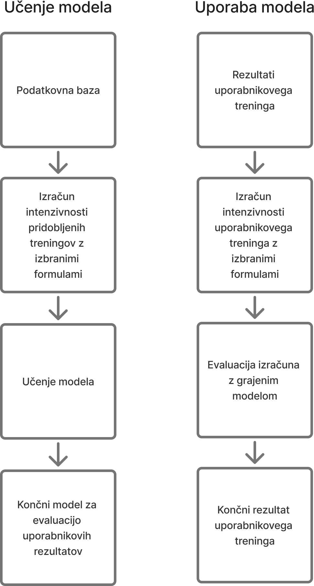

# Informacijski agent za statistično preverjanje učinkovitosti zadanega treninga

## Definicija problema

V današnjem času se vse več posameznikov poslužuje digitalnih orodij za spremljanje svoje telesne aktivnosti in napredka pri vadbi. Naprave, kot so fitnes sledilniki in aplikacije za beleženje vadb, zbirajo obsežne podatke o srčnem utripu, starosti, spolu, prehojeni ali pretečeni razdalji ter drugih parametrih. Kljub temu uporabniki pogosto nimajo jasnega vpogleda v to, kako učinkovito so opravili trening glede na svoje fiziološke značilnosti in zastavljene cilje.

Po podatkih Svetovne zdravstvene organizacije [[1]](#1) redna telesna aktivnost prispeva k izboljšanju zdravja in zmanjšanju tveganja za kronične bolezni, vendar je ključnega pomena tudi ustrezna intenzivnost vadbe. Srčni utrip med vadbo velja za pomemben kazalnik fiziološkega odziva telesa na obremenitev [[2]](#2). Ustrezna analiza srčnega utripa in drugih fizioloških podatkov omogoča oceno učinkovitosti treninga in prilagoditev vadbenih načrtov.

Cilj tega informacijskega sistema je na podlagi podatkov iz zbirk podatkov, kot sta vadba in sledilnik telesne pripravljenosti, statistično analizirati učinkovitost opravljenega treninga. Sistem bo preverjal, kako dobro je posameznik treniral, pri čemer bo upošteval ključne dejavnike, kot so povprečni in maksimalni srčni utrip med vadbo, starost, spol ter opravljena razdalja. 

Na podlagi podatkov iz pridobljene podatkovne baze [[3]](#3) bomo s pomočjo nevronskih mrež [[4]](#4) naučili model za odločanje intezivnosti vadbe. Pri določanju intenzivnosti vadbe bo uporabljena formula za izračun maksimalnega srčnega utripa, ki sta jo predlagala Tanaka, Monahan in Seals [[5]](#5), saj se je izkazala za natančnejšo od tradicionalnih metod.

    HRmax = 208 - 0.7 x starost
- HRmax je maksimalni srčni utrip, starost pa izražena v letih.

### Odstotek maksimalnega srčnega utripa med vadbo
Za določitev intenzivnosti vadbe lahko izračunamo povprečni odstotek doseženega maksimalnega srčnega utripa:

    HR% = (HRavg / HRmax) × 100

- kjer je HRavg povprečni srčni utrip med vadbo, HRmax pa maksimalni srčni utrip, določen s formulo Tanaka, Monahan in Seals.

### Obremenitveni indeks (angl. Training Load Index, TLI)
Obremenitveni indeks lahko ocenimo s formulo:

    TLI = HRavg × trajanje

- kjer je trajanje izraženo v minutah. Višja vrednost TLI pomeni večjo fiziološko obremenitev vadbe.

### MET (angl. Metabolic Equivalent of Task) – ocena energijske porabe
MET je enota, ki označuje porabo energije med vadbo glede na bazalno presnovo. Približno ga lahko ocenimo glede na srčni utrip in intenzivnost vadbe:

    MET = (HRavg / HRrest) × 3.5

- kjer je HRrest srčni utrip v mirovanju.

### Indeks učinkovitosti vadbe (angl. Workout Efficiency Index, WEI)
Kombiniramo več parametrov v enoten kazalnik:

    WEI = HR% × razdalja / trajanje

- kjer višja vrednost WEI pomeni bolj učinkovito vadbo glede na srčni utrip in prehojeno/pretečeno razdaljo.

S pomočjo naučenega modela bo agent uporabniku podal oceno uspešnosti vadbe in podal povratne informacije. 

Razvoj takšnega sistema bo omogočil boljše razumevanje vadbenih vzorcev ter pripomogel k vpogledu intezivnosti treningov na podlagi objektivnih fizioloških podatkov.

Poleg omenjenih metod bomo podatke pridobivali iz podatkovne baze ter raziskovali sami na sebi. V ta namen bomo mi sami služili kot testni primerki, pri čemer bomo primerjali različne vadbene pristope in njihove učinke. Pri zbiranju podatkov bomo uporabljali pametne zapestnice, kot je Apple Watch, ki omogočajo natančno beleženje srčnega utripa, porabe kalorij in drugih fizioloških parametrov med vadbo. Tako bomo lahko na podlagi realnih podatkov ocenili, kako učinkovito izvajamo različne tipe vadb. 

Integracija teh podatkov v informacijski agent bo omogočila še bolj natančno statistično preverjanje učinkovitosti zadanega treninga in vpogled v posameznikovo učinkovitost in intenziteto. 
 
 **Ključne besede:** Informacijski agent, fitnes sledilniki, analiza vadbe, srčni utrip, učinkovitost treninga, analiza podatkov, nevronske mreže in strojno učenje.
 
## Pregled evaluacije rešitve problema
Za zagotavljanje natančnosti in zanesljivosti informacijskega agenta za statistično preverjanje učinkovitosti zadanega treninga je ključno izvesti temeljito evalvacijo. Cilj evaluacije je preveriti, ali naš sistem pravilno ocenjuje intenzivnost vadbe, fiziološke parametre in posledično učinkovitost samega treninga.

Za dosego tega bomo uporabili dva ključne pristope:
 - Učenje nevronske mreže: Iz pridobljenih podatkov [[3]](#3) bomo zgradili model za oceno učinkovitosti izvedene vadbe 
 - Statistična analiza: Iz pridobljenega modela preverjali rezultate. 

 ## Načrt rešitve
 
 - **skupina:** 10
 - **sodelavci:** Leon Tikvič, Sabina Paurič in Klemen Golob
 - **repozitorij:** [GIT](https://github.com/dolfa321/POVEZLJIVI-SISTEMI-IN-INTELIGENTNE-STORITVE)
 - **programski jezik:** Python
 - **opravila**
    1. **Grajenje nevronske mreže in učenje modela na izbrani podatkovni bazi**
    3. **Implementacija osnovnega sistema odločanja**
    4. **Priprava uporabniškega vmesnika in zalednega dela za razčljenjanje realno pridobljenih podatkov**
    5. **Preverjanje natačnosti sistema na podlagi realno pridobljenih podatkov**
    6. **Optimizacija kode**
        - integracija evalvacijskih metod za merjenje uspešnosti
    7. **Uporabniški vmesnik**
        - pisanje članka
        - primerjava rezultatov
      
### Opis rešitve
Končna rešitev bo delujoč informacijski agent, ki na podlagi podatkov iz pametne zapestnice in shranjenih vadbenih podatkov uporabniku objektivno na podlagi naučenega modela poda rezultat o učinkovitosti in intenziteti treninga. 

### UML diagram

## Literatura oziroma pregled sorodnih del

[1] WHO. (2020). Physical activity and young adults: Recommendations for health and fitness. World Health Organization.

[2] Plews, D. J., Laursen, P. B., Kilding, A. E., & Buchheit, M. (2017). Heart rate variability and training intensity distribution in elite endurance athletes. Journal of Science and Medicine in Sport, 20(8), 798–803.

[3] Podatkovna baza https://www.kaggle.com/datasets/adilshamim8/workout-and-fitness-tracker-data

[4] Zou, Jinming, Yi Han, and Sung-Sau So. "Overview of artificial neural networks." Artificial neural networks: methods and applications (2009): 14-22.

[5] Tanaka, H., Monahan, K. D., & Seals, D. R. (2001). Age-predicted maximal heart rate revisited. Journal of the American College of Cardiology, 37(1), 153–156.

