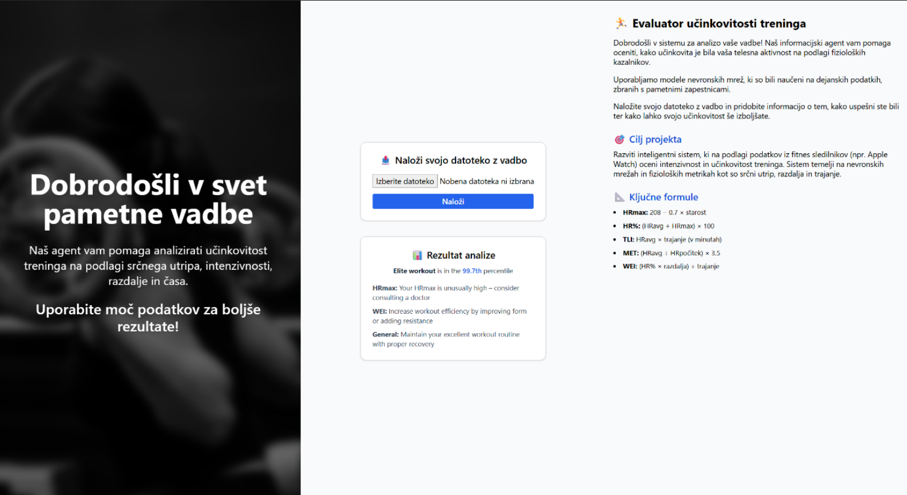
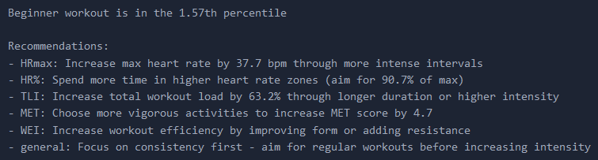
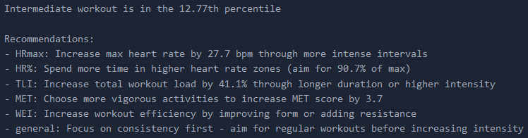
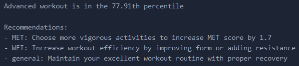
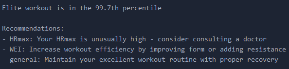
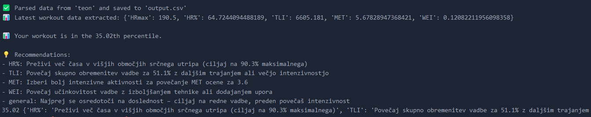

# INFORMACIJSKI AGENT ZA STATISTIČNO PREVERJANJE UČINKOVITOSTI ZADANEGA TRENINGA

**AVTORJI:**  
Sabina Paurič, Leon Tikvič in Klemen Golob

---

## POVZETEK

Projekt se osredotoča na razvoj inteligentnega sistema za analizo in napovedovanje učinkovitosti telesnih aktivnosti na podlagi podatkov uporabnikov. Namen sistema je pretvoriti surove podatke, pridobljene iz naprav za sledenje aktivnosti, v uporabne metrike, ocene in priporočila, ki posameznikom pomagajo izboljšati vadbene navade in doseči boljše rezultate.

Z uporabo Python/Flask na backendu, React.js na frontend strani in TensorFlow za modeliranje, aplikacija omogoča avtomatizirano obdelavo podatkov, napovedovanje percentilov ter generiranje personaliziranih priporočil.

---

## UVOD

Z vse večjim razvojem pametnih naprav, nosljivih senzorjev in aplikacij za sledenje telesni dejavnosti postaja zbiranje podatkov o fizični aktivnosti uporabnikov vse bolj razširjeno. Uporabniki danes rutinsko beležijo podatke o svojem srčnem utripu, trajanju vadbe, razdalji, hitrosti, porabljenih kalorijah in številnih drugih metrikah. Kljub tej množici podatkov pa veliko uporabnikov nima ustreznih orodij ali znanja, kako te podatke pravilno interpretirati in jih uporabiti za izboljšanje svojega zdravja, telesne pripravljenosti ali športne uspešnosti.

Cilj našega projekta je zapolniti to vrzel z razvojem inteligentnega sistema, ki uporabniku omogoča enostavno in poglobljeno analizo zbranih podatkov. Z uporabo naprednih tehnik obdelave podatkov smo želeli omogočiti:

- Avtomatsko pretvorbo surovih podatkov iz FIT datotek v uporabne informacije.  
- Izračun ključnih metrik, ki opisujejo intenzivnost, učinkovitost in obremenitev vadbe.  
- Oceno kakovosti treninga.  
- Generiranje konkretnih priporočil za izboljšanje vadbene rutine.

Projekt združuje sodobne pristope iz področij strojnega učenja, spletnega razvoja in uporabniške izkušnje ter ponuja temelj za nadaljnjo nadgradnjo v profesionalno fitnes orodje.

## SORODNA DELA

Komercialna orodja kot so Strava, Garmin Connect, Apple Fitness ponujajo analize vadb, vendar pogosto z malo natančnostjo in minimalnim upoštevanjem uporabnikovih podatkov med vadbo. Večina temelji na zaklenjenih modelih brez razlage.

Na področju znanstvene literature obstaja več del, ki se ukvarjajo s priporočili za telesno aktivnost in metodami za ocenjevanje intenzivnosti vadbe. Svetovna zdravstvena organizacija (WHO) je izdala smernice za telesno aktivnost mladih odraslih, ki vključujejo priporočene količine zmerne in intenzivne vadbe na teden [[1]](#1).

Pomemben prispevek k razumevanju vpliva vadbe na srčni utrip in prilagajanje intenzivnosti treninga predstavljajo raziskave, kot je delo Plewsa in sodelavcev, ki analizira spremenljivost srčnega utripa pri elitnih vzdržljivostnih športnikih ter razporeditev intenzivnosti treninga [[2]](#2).

Pri zasnovi modela za napovedovanje kakovosti vadbe smo uporabili podatkovno zbirko z realnimi podatki o različnih treningih, ki je dostopna na platformi Kaggle [[3]](#3). Ta podatkovna baza vključuje širok spekter metrik, kot so trajanje vadbe, razdalja, srčni utrip ipd., ter različnih okolij v katerih so vadbe bile izvedene (Cardio, Cycling, HIIT, Running, Strength, Yoga).

Za razvoj umetne inteligence in nevronskih mrež smo se oprli na pregled delovanja umetnih nevronskih mrež, kot jih predstavljajo Zou in sodelavci [[4]](#4), ter uporabili znano formulo za oceno maksimalnega srčnega utripa glede na starost, ki jo je predlagal Tanaka [[5]]. Skupaj ta dela predstavljajo teoretično in praktično osnovo, na kateri smo zgradili naš pristop.

V literaturi so bile predlagane različne metrike za oceno vadbe, med njimi MET, TLI in HR%, ki so bile uporabljene tudi v našem modelu.

## METODOLOGIJA

Cilj metodološkega pristopa v tem projektu je zagotoviti postopek od zbiranja podatkov do interpretacije rezultatov, ki uporabniku nudi povratno informacijo o učinkovitosti oddelanega treninga. Vključuje avtomatizirano obdelavo podatkov, izračun vadbenih metrik, uporabo strojnega učenja za oceno kakovosti vadb ter prikaz rezultatov v uporabniškem vmesniku.

Metodologija je razdeljena na štiri glavne faze: obdelava podatkov, modeliranje, implementacija zalednega sistema, ter razvoj uporabniškega vmesnika.

### OBDELAVA PODATKOV

- Uvoz CSV datotek s podatki uporabnikov  
- Preverjanje prisotnosti potrebnih stolpcev: Workout Type, Age, Heart Rate, Workout Duration, Distance, Resting HR  
- Razdelitev po tipu vadbe  
- Implementacija funkcije `calculate_formulas()` za računanje metrik:

  - HRmax = 208 - 0.7 * age  
  - HR% = (Heart Rate / HRmax) * 100  
  - TLI = Heart Rate * Workout Duration  
  - MET = (Heart Rate / Resting HR) * 3.5  
  - WEI = (HR% * Distance) / Workout Duration  

- Shranjevanje analiziranih CSV-jev po tipih vadb  

### UPORABNIŠKA INTERAKCIJA

Celoten sistem temelji na naslednjih fazah:

1. Vnos podatkov – uporabnik naloži datoteko FIT prek spletnega vmesnika.  
2. Validacija podatkov – sistem preveri ustreznost strukture in vrednosti.  
3. Izračun metrik – z uporabo vnaprej definiranih formul se za vsak zapis izračunajo ključne značilke vadbe.  
4. Modeliranje in napoved – podatki se prenesejo v model, ki napove kvaliteto treninga in poda priporočila.

## MODELIRANJE

### Primeri vhodno-izhodnih podatkov

Za namene testiranja in učenja modela smo uporabili strukturirane podatke v obliki slovarjev (JSON), kjer so vhodne značilke izražene z naslednjimi vrednostmi:

Primer vhodnega zapisa (input):

```json
{
  "HRmax": 185,
  "HR%": 82,
  "TLI": 8500,
  "MET": 8.2,
  "WEI": 1.4
}
```

Ta zapis predstavlja trening z maksimalnim srčnim utripom 185, intenzivnostjo 82 %, indeksom obremenitve 8500, metaboličnim ekvivalentom 8.2 in učinkovitostjo 1.4.

Izhodni rezultat modela (output):
```json
{
  "percentile": 93.2,
  "recommendations": [
    "Povečajte razdaljo za izboljšanje WEI",
    "Zmanjšajte trajanje za optimalen TLI",
    "Ohranite trenutni srčni utrip – ustreza visoki učinkovitosti"
  ]
}
```

Model vrne oceno, da je ta vadba v 93.2. percentilu (med najboljšimi), ter ponudi priporočila za optimizacijo, ki temeljijo na primerjavi z najboljšimi vadbami.

### PROCES UČENJA MODELA

Za učenje modela smo pripravili ločene podatkovne množice za vsak tip treninga (npr. Running, Cycling itd.), kar omogoča prilagajanje modela glede na značilnosti vsakega.

## MODELIRANJE

### Tipi vadbe

Ti podatki so predhodno obdelani z izračunom petih ključnih metrik: HRmax, HR%, TLI, MET in WEI. Nato se izračunajo percentili za podano vadbo.

Implementirali smo naslednje ključne komponente:

- `trainer.py`: vsebuje glavno logiko za učenje modela. Tukaj definiramo strukturo nevronske mreže, inicializiramo model (Sequential s tremi plastmi), nastavimo parametre učenja (optimizer Adam, funkcija izgube = 'mean_squared_error') in izvajamo trening s podatki.

- `dataset.py`: definira razred za branje in pripravo podatkov iz analiziranih CSV datotek. Vključuje normalizacijo vhodov in oblikovanje tenzorjev za učenje.

- `model_saver.py`: skrbi za shranjevanje modelov v `.h5` formatu in spremljajočih atributov (npr. skalirne vrednosti) v `.pkl` datotekah.

- `evaluate.py`: omogoča testiranje naloženega modela z realnimi ali vnaprej definiranimi primeri. Prikazuje percentil in generira priporočila.

Učenje modelov poteka za vsak tip treninga posebej:

- Prebere se ustrezen analizirani CSV.
- Izvede se izračun tarčne spremenljivke (percentil).
- Podatki se normalizirajo in pretvorijo v ustrezen format.
- Model se uči 100 epoh (ali do zgodnjega ustavljanja).
- Rezultat se shrani kot `.h5` in pripadajoči `.pkl` za ponovno uporabo.

### Utemeljitev izbranih pristopov

Za modeliranje smo uporabili preprost večslojni perceptron, saj gre za regresijsko nalogo, kjer napovedujemo percentil na podlagi numeričnih metrik. Arhitektura s tremi plastmi je bila izbrana zaradi ravnovesja med zmogljivostjo in interpretabilnostjo. Funkcije ReLU in Sigmoid omogočajo učinkovito učenje nelinearnih relacij.

Model je treniran posebej za vsak tip vadbe, ker se metrike in njihova distribucija lahko bistveno razlikujejo med npr. tekom in kolesarjenjem. Ločeni modeli tako zagotavljajo višjo točnost in bolj smiselna priporočila.

## Backend (Flask)

Zaledni del aplikacije je bil zgrajen z ogrodjem Flask (Python), ki služi kot most med uporabniškim vmesnikom in prediktivnimi modeli. Backend je bil zasnovan na naslednji način:

### Struktura

- `main.py` vsebuje inicializacijo aplikacije in definicije API poti.
- `predict.py` obdeluje logiko nalaganja modelov in izvajanje napovedi na podlagi vhodnih podatkov.
- `recommend.py` skrbi za generiranje vsebinsko ustreznih priporočil.
- `utils.py` vključuje pomožne funkcije, kot so izračun metrik in validacija podatkov.

### Podprt API

- `/upload`: prejme datoteko od uporabnika, jo shrani, ter obdela in vrne rezultate pridobljene z modelom.

### Obdelava datotek

- Backend omogoča nalaganje datotek tipa `.fit`.
- Pri `.fit` datotekah se uporablja vgrajeni parser, ki izloči časovno zaporedje srčnega utripa, hitrosti in trajanja.

### Povezava z modeli

- Backend za vsak tip vadbe naloži ustrezen model iz mape `models/`.
- Model se nato uporablja za napoved percentila in povzetek priporočil.

Takšna arhitektura omogoča razširljivost, saj lahko v prihodnje preprosto dodamo nove modele, API-je ali podporo za dodatne tipe datotek.

## Omejitve in izzivi

Kljub uspešni implementaciji sistem vključuje nekatere omejitve:

- Občutljivost na netočne ali manjkajoče vhodne podatke.
- Razlike v kakovosti podatkov glede na napravo (npr. različne natančnosti meritev).
- Dolgoročno bo potrebna tudi večja baza uporabniških primerov za učenje bolj splošnega modela.

## Frontend (React.js)

Uporabniški vmesnik sistema je zasnovan tako, da omogoča interakcijo tudi manj tehnično podkovanim uporabnikom. Na levi strani zaslona uporabnika pozdravi dobrodošlica in jasna razlaga cilja sistema: ocena učinkovitosti vadbe na podlagi podatkov.

V sredini se nahaja obrazec za nalaganje datoteke s treningom. Uporabnik lahko naloži svojo datoteko v formatu .fit, po čemer se sproži obdelava in prikaz rezultatov.

Na desni strani uporabniškega vmesnika se nahaja razlaga sistema in njegovih ključnih formul. Tu uporabnik vidi tudi:

- Cilj projekta (ocena vadbe z nevronskimi mrežami)
- Uporabljene formule (HRmax, HR%, TLI, MET, WEI)
- Opis delovanja modela

Po uspešni obdelavi se v vmesniku prikaže rezultat analize, ki vključuje:

- Percentil učinkovitosti treninga (npr. »Vadba je v 99.7 percentilu«)
- Komentarje o HRmax, WEI in splošna priporočila

Vizualna zasnova je minimalistična in informativna, kar povečuje uporabniško izkušnjo in dostopnost.

Implementacija osnovnih komponent:

- Nalaganje datotek in podatkov
- Prikaz analiziranih metrik
- Vizualizacija percentilov in priporočil
- Integracija s Flask API-ji



# POSKUSI IN REZULTATI

Za preverjanje funkcionalnosti razvitega sistema smo izvedli več testov, tako z umetno pripravljenimi primeri, podatki podatkovne baze, ter lastno pridobljenimi podatki. Glavni namen testiranj je bil oceniti natančnost modela. Prav tako smo želeli preveriti, ali je sistem natančen pri vseh različnih tipih vadb in ali so generirana priporočila relevantna glede na vhodne podatke.

## Testni primeri

Funkcija `test_model_with_hardcoded_data()` definira 4 tipe uporabnikov:

- **Beginner**  
  ```json
  {
    "HRmax": 150,
    "HR%": 70,
    "TLI": 5000,
    "MET": 5,
    "WEI": 0.5
  }
  ```

  

- **Intermediate**  
  ```json
  {
    "HRmax": 160,
    "HR%": 80,
    "TLI": 8000,
    "MET": 6,
    "WEI": 1
  }
  ```

  

 - **Advanced**  
    ```json
    {
      "HRmax": 182.8,
      "HR%": 91.9,
      "TLI": 12264,
      "MET": 8.05,
      "WEI": 1.38
    }
    ```

    

 - **Elite**  
    ```json
    {
      "HRmax": 208,
      "HR%": 100,
      "TLI": 20800,
      "MET": 10,
      "WEI": 2
    }
    ```

    

 - **Lastno pridobljeni podatki (Leon Tikvič)**

    
    

## Podrobnosti testiranja

Za vsak testni primer smo analizirali vhodne vrednosti ter spremljali izračunane metrike in napovedan percentil. Rezultati so pokazali, da sistem pravilno identificira in oceni intenziteto treninga ter da lahko jasno priporoči izboljšave, kot so povečanje intenzivnosti ali trajanja vadbe.

# ZAKLJUČEK

Projekt je dosegel vse zastavljene cilje. Zgrajen je bil sistem, ki avtomatsko analizira vadbene podatke, izračuna napredne metrike, napove kakovost vadbe in poda konkretna priporočila.

Razviti sistem dokazuje, kako lahko sodobne tehnologije in obdelave podatkov pripomorejo k bolj učinkovitemu spremljanju in izboljševanju telesne pripravljenosti. Ker sistem nudi jasna pojasnila rezultatov in intuitiven vmesnik, ga lahko brez težav uporabljajo tako začetniki kot tudi izkušeni športniki ali trenerji.

Zaradi strukturiranega pristopa in uporabe ločenih modelov za vsak tip vadbe ima sistem potencial za nadaljnjo rast in nadgradnjo. Z dodatkom več podatkov, kompleksnejših nevronskih arhitektur ali vključitvijo dodatnih parametrov (npr. spanje, prehrana, stres) bi lahko izboljšali natančnost in razumevanje vzorcev vadbe.

## Možnosti za prihodnji razvoj:

- Sinhronizacija z obstoječimi aplikacijami (Garmin, Apple), kar bi omogočilo samodejni uvoz podatkov in večjo uporabniško enostavnost.
- Vizualna analiza napredka uporabnika skozi čas z uporabo časovnih grafov, poročil in trendnih analiz.
- Vključitev dodatnih dimenzij za modeliranje, kot so spanje, prehrana, stres in regeneracija, kar bi omogočilo bolj celosten vpogled v zdravje uporabnika.
- Implementacija mobilne aplikacije za večjo dostopnost sistema in obvestila v realnem času.
- Razvoj personaliziranih načrtov vadbe na podlagi analize preteklih treningov in napovedi prihodnje učinkovitosti.

# VIRI

- [Povezljivi sistemi in inteligentne storitve - GitHub](https://github.com/dolfa321/POVEZLJIVI-SISTEMI-IN-INTELIGENTNE-STORITVE)

- Uporabljene knjižnice: pandas, numpy, tensorflow, flask, scikit-learn, joblib

- Dokumentacija o FIT datotekah: [https://www.thisisant.com/resources/fit](https://www.thisisant.com/resources/fit)

- Akademski viri o srčnem utripu in MET izračunih:

  1. WHO. (2020). *Physical activity and young adults: Recommendations for health and fitness*. World Health Organization.

  2. Plews, D. J., Laursen, P. B., Kilding, A. E., & Buchheit, M. (2017). Heart rate variability and training intensity distribution in elite endurance athletes. *Journal of Science and Medicine in Sport*, 20(8), 798–803.

  3. Podatkovna baza: [https://www.kaggle.com/datasets/adilshamim8/workout-and-fitness-tracker-data](https://www.kaggle.com/datasets/adilshamim8/workout-and-fitness-tracker-data)

  4. Zou, J., Han, Y., & So, S.-S. (2009). Overview of artificial neural networks. In *Artificial neural networks: methods and applications* (pp. 14–22).

  5. Tanaka, H., Monahan, K. D., & Seals, D. R. (2001). Age-predicted maximal heart rate revisited. *Journal of the American College of Cardiology*, 37(1), 153–156.
